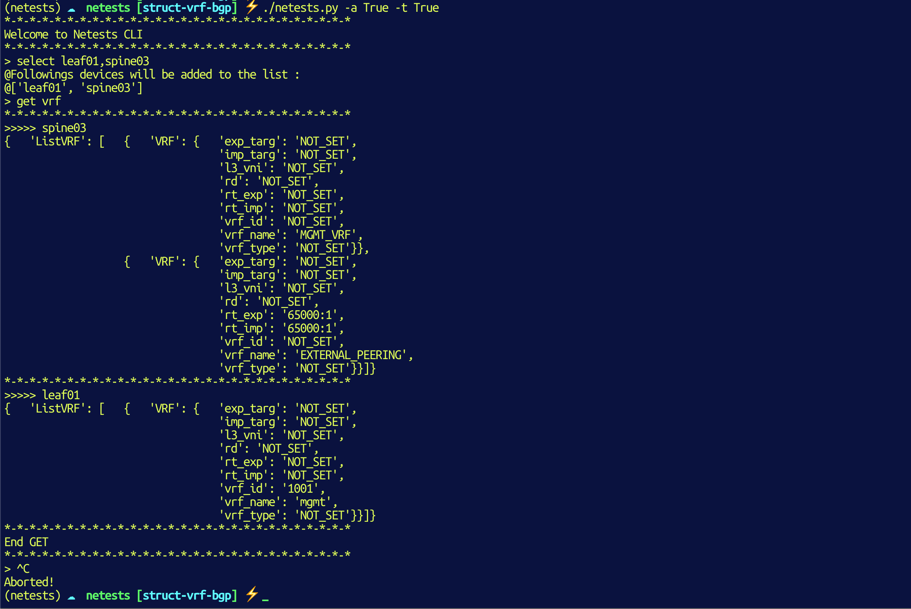

# Netests.io

###### <dylan.hamel@protonmail.com> - June 2020 - Copyright


## Documentation

https://www.netests.io/


## How to use ??

This tool contains two modes :

* Integrity & Sanity checks
* CLI 


### Integrity & Sanity checks

The idea of this project is to offer a test platform for the network to allow engineers to perform tests without having to write python code (or other languages :smile:).

In addition, this platform does not consider the OS, it is possible to run tests on Cisco, Cumulus, Juniper devices without changing the data structure.


#### Define inventory

1) You have to create a Nornir or an Ansible inventory (Example based on an Ansible Inventory)

`hosts` file.

```yaml
[leaf]
leaf01 # Cumulus Networks
leaf02 # Cisco Nexus 9k
leaf03 # Arista vEOS
leaf04 # Juniper Networks
leaf05 # Cisco IOS

[spine]
spine01 # Cumulus Networks
spine02 # Extreme Networks VSP
spine03 # Cisco IOS-XR
```

2) Define device parameters in ``host_vars/inventory_hostname.yml`` files

```yaml
hostname: 10.0.5.202
platform: linux        # <<=== specify device OS (Cumulus Linux)
username: admin
password: Ci$co123
connexion: ssh         # <<=== specify connexion method - check supported protocols 
port: 22
```

```yaml
hostname: 10.0.5.204
platform: junos        # <<=== specify device OS (Juniper)
username: root
password: Jun1p3r
connexion: netconf     # <<=== specify connexion method - check supported protocols 
port: 830
```

```yaml
hostname: 10.0.5.203
platform: eos          # <<=== specify device OS (Arista)
username: admin
password: admin123
connexion: api         # <<=== specify connexion method - check supported protocols 
port: 443
```


#### Define tests

Tests are defined in the file `netests.yml`. In this file you can define which test will be executed.

```yaml
config:
  nornir_cfg: ./nornir/config_ansible.yml
  inventory: ./inventory/ansible/hosts
  protocols:
    bgp:
      test: false

    cdp:
      test: false

    lldp:
      test: true

    facts:
      test: false
      
    ping:
      test: false
```

In `truth_vars/` you need to define the configuration that you want on your production devices.

### Exemple  :

There are three ways to define variables :

1. For a specific host - define your configuration in `truth_vars/hosts/hostname/protocol.yml`

LLDP configuration

```yaml
- local_name: leaf03
  local_port: Ethernet1
  neighbor_mgmt_ip: 192.168.1.148
  neighbor_name: cumulus
  neighbor_os: Cumulus Linux version 4.0.0
  neighbor_port: swp1
  neighbor_type: ["Bridge", "Router"]
```

> Will test that the neighbor on the port `Ethernet1` is a device named `cumulus` and the connexion is on the port `swp1`.

2. For all hosts defined in a group - such as `spines` - define in `truth_vars/groups/group/protocol.yml`

Group is `spine-arista`.
Facts configuration

```yaml
domain: dh.local
version: 4.24.0F
```

>Will test if all devices linked to this group has `dh.local` as domain name, `4.24.0F` as version.

3. for all devices - define `truth_vars/all/{{ protocol }}.yml`

```
domain: dh.local
```

> Will test if all devices in your inventory have t domain `dh.local`.


The script will connect on each devices, retrieveinformations and campre them with the data define in your `truth_vars/` (source of truth).

If the informations are the same the tests is OK :smile:

#### Run the script

```shell
./netests.py -x -i inventory/ansible/hosts -a netests.yml
[netests - base_run.py](ping) is working = True

# -x / Define that you will use an Ansible inventory
# -i / Path to your Ansible inventory
# -a / Path to your netests configuration file (default is netests.yml)
```


### Netests-CLI

You can get some informations regarding you network configuration directly from the CLI.

This tool will use your Ansible/Nornir/Netbox Inventory. For example :

```shell
[leaf]
leaf01
leaf02
leaf03
leaf04
leaf05

[spine]
spine01
spine02
spine03
```

#### Run the CLI tool

```shell
⚡ ./netests.py -x -i inventory/ansible/hosts -a netests.yml -t
*-*-*-*-*-*-*-*-*-*-*-*-*-*-*-*-*-*-*-*-*-*-*-*-*-*-*-*
Welcome to Netests CLI
*-*-*-*-*-*-*-*-*-*-*-*-*-*-*-*-*-*-*-*-*-*-*-*-*-*-*-*
```

#### Get HELP

```
> help
+------------------------------------------------------------+
|                       Netests Help                         |
+------------------------------------------------------------+
| [help]      Display help                                   |
| [select]    Select devices on which on action will be exec |
| [unselect]  Remove a device from the selected              |
| [selected]  Show devices currently selected                |
| [get xx]   Get XX protocols informations                   |
| [options]   Set arguments that will retrieve for a Protocol|
| [more xx]  Show XX Protocol class arguments selected       |
| [show xx]  Show XX Protocol class arguments                |
| [print yy]  Show YY devices informations                   |
| [compare yy xx]  Compare device config with source of truth|
| [exit]  Quit Netests CLI                                   |
+------------------------------------------------------------+
```


#### Get help for a specific command

```
> help options
+------------------------------------------------------------+
|                 Netests - Options Commands                 |
+------------------------------------------------------------+
| This command is used to define which parameter will be     |
| retrieve for a protocol.                                   |
| It is possible to get a subset of protocols parameters.    |
| Format :                                                   |
|   > options  {{ protocol }}  {{ classArg1,classArg2  }}    |
|   (To get all protocols parameters use the 'show' command) |
|                                                            |
| Examples :                                                 |
|   > options vrf vrf_name,rd,rt_imp,rt_exp                  |
+------------------------------------------------------------+
```


#### Print hosts defined in your inventory :

```
{   'leaf01': {   'connexion': 'ssh',
                  'hostname': '172.16.194.51',
                  'platform': 'linux',
                  'port': 22},
    'leaf02': {   'connexion': 'api',
                  'hostname': 'sbx-nxos-mgmt.cisco.com',
                  'platform': 'nxos',
                  'port': 443},
    'leaf04': {   'connexion': 'netconf',
                  'hostname': '66.129.235.11',
                  'platform': 'junos',
                  'port': 40002},
    'leaf05': {   'connexion': 'ssh',
                  'hostname': 'ios-xe-mgmt.cisco.com',
                  'platform': 'ios',
                  'port': 8181}}
```


#### Select devices

At the beginning if you use a command to get some network informations, nothing will happend. The reason is that no device is selected.

```shell
> get vrf
[[netests - get_vrf]] no device selected.
*-*-*-*-*-*-*-*-*-*-*-*-*-*-*-*-*-*-*-*-*-*-*-*-*-*-*-*
@End GET
*-*-*-*-*-*-*-*-*-*-*-*-*-*-*-*-*-*-*-*-*-*-*-*-*-*-
```

You have to select devices on which one you would get informations

##### Select all devices in the inventory

```shell
> select *
@Followings devices will be added to the list :
@['leaf01', 'leaf02', 'leaf03', 'leaf04', 'leaf05', 'spine01', 'spine02', 'spine03']
```

##### Select only a subset of devices

```
> select leaf01,spine03
@Followings devices will be added to the list :
@['leaf01', 'spine03']
```


#### Print selected devices

```
> selected
@Followings devices are selected :
@['leaf01', 'leaf02', 'leaf04', 'leaf05']
```


#### Execute GET

Run the command `get` and the protocols that you would like retrieve.

```shell
> select leaf01,spine03
@Followings devices will be added to the list :
@['leaf01', 'spine03']
> get vrf
*-*-*-*-*-*-*-*-*-*-*-*-*-*-*-*-*-*-*-*-*-*-*-*-*-*-*-*
>>>>> spine03
{   'ListVRF': [   {   'VRF': {   'exp_targ': 'NOT_SET',
                                  'imp_targ': 'NOT_SET',
                                  'l3_vni': 'NOT_SET',
                                  'rd': 'NOT_SET',
                                  'rt_exp': 'NOT_SET',
                                  'rt_imp': 'NOT_SET',
                                  'vrf_id': 'NOT_SET',
                                  'vrf_name': 'MGMT_VRF',
                                  'vrf_type': 'NOT_SET'}},
                   {   'VRF': {   'exp_targ': 'NOT_SET',
                                  'imp_targ': 'NOT_SET',
                                  'l3_vni': 'NOT_SET',
                                  'rd': 'NOT_SET',
                                  'rt_exp': '65000:1',
                                  'rt_imp': '65000:1',
                                  'vrf_id': 'NOT_SET',
                                  'vrf_name': 'EXTERNAL_PEERING',
                                  'vrf_type': 'NOT_SET'}}]}
*-*-*-*-*-*-*-*-*-*-*-*-*-*-*-*-*-*-*-*-*-*-*-*-*-*-*-*
>>>>> leaf01
{   'ListVRF': [   {   'VRF': {   'exp_targ': 'NOT_SET',
                                  'imp_targ': 'NOT_SET',
                                  'l3_vni': 'NOT_SET',
                                  'rd': 'NOT_SET',
                                  'rt_exp': 'NOT_SET',
                                  'rt_imp': 'NOT_SET',
                                  'vrf_id': '1001',
                                  'vrf_name': 'mgmt',
                                  'vrf_type': 'NOT_SET'}}]}
*-*-*-*-*-*-*-*-*-*-*-*-*-*-*-*-*-*-*-*-*-*-*-*-*-*-*-*
@End GET
*-*-*-*-*-*-*-*-*-*-*-*-*-*-*-*-*-*-*-*-*-*-*-*-*-*-*-*
```


#### Compare config with `truth_vars/`

```
> compare facts
*-*-*-*-*-*-*-*-*-*-*-*-*-*-*-*-*-*-*-*-*-*-*-*-*-*-*-*-*-*-*-*-*-*-*-*-*-*-*-*-*-*-*-*-
{   'Facts': {   'base_mac': 'NOT_SET',
                 'build': 'fc2',
                 'domain': 'NOT_SET',
                 'hostname': 'csr1000v',
                 'interfaces_lst': [   'GigabitEthernet1',
                                       'GigabitEthernet2',
                                       'GigabitEthernet3',
                                       'Loopback3',
                                       'Loopback1234',
                                       'Loopback9009'],
                 'memory': '8113280',
                 'model': 'CSR1000V',
                 'serial': '9OOFTICVAFM',
                 'vendor': 'Cisco',
                 'version': '16.9.3'}}
[netests - compare_facts] Key infos_data is missingfor leaf05 or no Facts data has been found.
*-*-*-*-*-*-*-*-*-*-*-*-*-*-*-*-*-*-*-*-*-*-*-*-*-*-*-*-*-*-*-*-*-*-*-*-*-*-*-*-*-*-*-*-
@The following devices have the same configuration that defined in the source of truth :
@[leaf05].
*-*-*-*-*-*-*-*-*-*-*-*-*-*-*-*-*-*-*-*-*-*-*-*-*-*-*-*-*-*-*-*-*-*-*-*-*-*-*-*-*-*-*-*-
>
```

#### Screenshot




## Contributor

Dylan Hamel - <dylan.hamle@protonmail.com>
