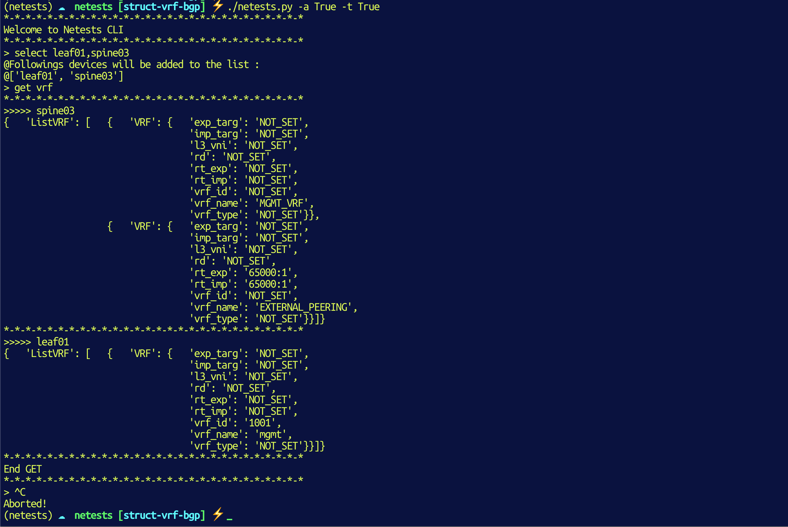

# Netests.io

###### <dylan.hamel@protonmail.com> - November 2019 - Copyright


## Install

Create your environnement :

```shell
» python3 -m venv .
» source ./bin/activate

(netests) ------------------------------------------------------------
(master*) »

» pip install --upgrade pip
» pip --version
pip 19.2.3
```


## Devices used 

#### Cisco IOS-XE

```shell
ROM: IOS-XE ROMMON
BOOTLDR: System Bootstrap, Version 16.12.1r, RELEASE SOFTWARE (P)
```

#### Cisco Nexus NXOS

```shell
Nexus 9000v is a demo version of the Nexus Operating System

Software
  BIOS: version
  NXOS: version 7.0(3)I7(5a)
  BIOS compile time:
  NXOS image file is: bootflash:///nxos.7.0.3.I7.5a.bin
  NXOS compile time:  10/12/2018 19:00:00 [10/13/2018 03:16:04]
```

#### Juniper VMX

```shell
> show version
Hostname: leaf04
Model: vmx
Junos: 18.3R1.9
#----------------------
> show version
Hostname: leaf04
Model: vmx
Junos: 19.4R1.10
```


## How to use ??

This tool contains two modes :

* Integrity & Sanity checks
* CLI 


### Integrity & Sanity checks

The idea of this project is to offer a test platform for the network to allow engineers to perform tests without having to write python code (or other languages :smile:).

In addition, this platform does not consider the OS, it is possible to run tests on Cisco, Cumulus, Juniper devices without changing the data structure.

#### Define inventory

1) You have to create a Nornir or an Ansible inventory (Example based on an Ansible Inventory)

`hosts` file.

```yaml
[leaf]
leaf01	# Cumulus Networks
leaf02	# Cisco Nexus 9k
leaf03	# Arista vEOS
leaf04	# Juniper Networks
leaf05	# Cisco IOS

[spine]
spine01	# Cumulus Networks
spine02	# Extreme Networks VSP
spine03	# Cisco IOS-XR
```

2) Define device parameters in ``host_vars/inventory_hostname.yml`` files

```yaml
hostname: 10.0.5.202
username: admin
password: Ci$co123
platform: linux			# <<=== specify device OS
port: 22
connexion: ssh
```

```yaml
hostname: 10.0.5.204
username: root
password: Jun1p3r
platform: junos			# <<=== specify device OS
port: 2222
connexion: ssh
```

```yaml
hostname: 10.0.5.203
username: admin
password: admin123
platform: eos				# <<=== specify device OS
port: 443
```

If `connexion: ssh` is not specify and the OS is supported by NAPALM, NAPALM will be used.

* Cumulus --->> SSH session on port 22
* Juniper --->> SSH session on port 2222
* Arista --->> REST API call on port 443

#### Define tests

Tests are defined in the file `verity/_test_to_execute.yml`. In this file you can define which test will be executed.

```yaml
# Each test can be in 3 types.
# 1) yes || true => (Mandatory) - If test failed Pipeline will be stopped
# 2) info =>  (Informations) - If test failed you will only see a message
# 3) no || false => (Exclude) - Test will not be executed
# Check Link Discovery Protocols sessions
lldp: true
```

In the same directory you can describe which LLDP sessions you want have on devices (`verity/lldp.yml`).

```yaml
spine01:
  - local_port: swp1
    neighbor_name: leaf01
    neighbor_port: swp1
  - local_port: swp2
    neighbor_name: leaf02
    neighbor_port: Eth1/1
  - local_port: swp3
    neighbor_name: leaf03
    neighbor_port: Eth1/1

leaf02:
  - local_port: Eth1/1
    neighbor_name: spine01
    neighbor_port: swp2
  - local_port: Eth1/7
    neighbor_name: leaf03
    neighbor_port: Eth1/3

leaf03:
  - local_port: Eth1/1
    neighbor_name: spine01
    neighbor_port: swp3
  - local_port: Eth1/3
    neighbor_name: leaf02.dh.local
    neighbor_port: Eth1/7
```

The script will connect on each device and retrieve LLDP sessions informations and campre them with the data define in ``verity/lldp.yml``.

If the informations are the same the tests is OK :smile:

#### Run the script

```shell
» ./main.py --ansible=True
[netests - main.py] BGP_SESSIONS tests are not executed !!
[netests - main.py] All BGP sessions tests are not executed !!
[netests - main.py] LLDP sessions are the same that defined in ./verity/lldp.yml = True
[netests - main.py] CDP sessions tests are not executed !!
[netests - main.py] VRF tests are not executed !!
[netests - main.py] Pings have not been executed !!
[netests - main.py] OSPF have not been executed !!
[netests - main.py] IPv4 addresses have not been executed !!
[netests - main.py] Static routes have not been executed !!
[netests - main.py] System informations have not been executed !!
```


#### BGP with VRF example

```yaml
---
spine01:
  default:
    asn: 65100
    router_id: 10.255.255.101
    neighbors:
      - peer_ip: 10.255.255.201
        remote_as: 65201
      - peer_ip: 10.255.255.202
        remote_as: 65202
      - peer_ip: 10.255.255.203
        remote_as: 65203
        state: DOWN
  mgmt:
    asn: 65100
    router_id: 1.1.1.1
    neighbors:
      - peer_ip: 10.0.5.203
        remote_as: 65203
        state: UP
      - peer_ip: 10.0.5.202
        remote_as: 65202
        state: DOWN


leaf02:
  default:
    asn: 65202
    router_id: 10.255.255.202
    neighbors:
      - peer_ip: 10.255.255.101
        remote_as: 65100

leaf03:
  default:
    asn: 65203
    router_id: 10.255.255.203
    neighbors:
      - peer_ip: 10.255.255.101
        remote_as: 65100
        state: UP
      - peer_ip: 10.255.255.202
        remote_as: 65202
```


### Netests-CLI

You can get some informations regarding you network configuration directly from the CLI.

This tool will use your Ansible/Nornir/Netbox Inventory. For example :

```shell
[leaf]
leaf01
leaf02
leaf03
leaf04
leaf05

[spine]
spine01
spine02
spine03
```

#### Run the CLI tool

```shell
⚡ ./netests.py -a True -t True
*-*-*-*-*-*-*-*-*-*-*-*-*-*-*-*-*-*-*-*-*-*-*-*-*-*-*-*
Welcome to Netests CLI
*-*-*-*-*-*-*-*-*-*-*-*-*-*-*-*-*-*-*-*-*-*-*-*-*-*-*-*
```

#### Get HELP

```
> help
+------------------------------------------------------------+
|                       Netests Help                         |
+------------------------------------------------------------+
| [help]      Display help                                   |
| [select]    Select devices on which on action will be exec |
| [unselect]  Remove a device from the selected              |
| [get xxx]   Get XXX protocols informations                 |
+------------------------------------------------------------+
```

#### Select devices

At the beginning if you use a command to get some network informations, nothing will happend. The reason is that no device is selected.

```shell
> get vrf
[[netests - get_vrf]] no device selected.
*-*-*-*-*-*-*-*-*-*-*-*-*-*-*-*-*-*-*-*-*-*-*-*-*-*-*-*
@End GET
*-*-*-*-*-*-*-*-*-*-*-*-*-*-*-*-*-*-*-*-*-*-*-*-*-*-
```

You have to select devices on which one you would get informations

##### Select all devices in the inventory

```shell
> select *
@Followings devices will be added to the list :
@['leaf01', 'leaf02', 'leaf03', 'leaf04', 'leaf05', 'spine01', 'spine02', 'spine03']
```

##### Select only a subset of devices

```
> select leaf01,spine03
@Followings devices will be added to the list :
@['leaf01', 'spine03']
```

#### Execute GET

Run the command `get` and the protocols that you would like retrieve.

```shell
> select leaf01,spine03
@Followings devices will be added to the list :
@['leaf01', 'spine03']
> get vrf
*-*-*-*-*-*-*-*-*-*-*-*-*-*-*-*-*-*-*-*-*-*-*-*-*-*-*-*
>>>>> spine03
{   'ListVRF': [   {   'VRF': {   'exp_targ': 'NOT_SET',
                                  'imp_targ': 'NOT_SET',
                                  'l3_vni': 'NOT_SET',
                                  'rd': 'NOT_SET',
                                  'rt_exp': 'NOT_SET',
                                  'rt_imp': 'NOT_SET',
                                  'vrf_id': 'NOT_SET',
                                  'vrf_name': 'MGMT_VRF',
                                  'vrf_type': 'NOT_SET'}},
                   {   'VRF': {   'exp_targ': 'NOT_SET',
                                  'imp_targ': 'NOT_SET',
                                  'l3_vni': 'NOT_SET',
                                  'rd': 'NOT_SET',
                                  'rt_exp': '65000:1',
                                  'rt_imp': '65000:1',
                                  'vrf_id': 'NOT_SET',
                                  'vrf_name': 'EXTERNAL_PEERING',
                                  'vrf_type': 'NOT_SET'}}]}
*-*-*-*-*-*-*-*-*-*-*-*-*-*-*-*-*-*-*-*-*-*-*-*-*-*-*-*
>>>>> leaf01
{   'ListVRF': [   {   'VRF': {   'exp_targ': 'NOT_SET',
                                  'imp_targ': 'NOT_SET',
                                  'l3_vni': 'NOT_SET',
                                  'rd': 'NOT_SET',
                                  'rt_exp': 'NOT_SET',
                                  'rt_imp': 'NOT_SET',
                                  'vrf_id': '1001',
                                  'vrf_name': 'mgmt',
                                  'vrf_type': 'NOT_SET'}}]}
*-*-*-*-*-*-*-*-*-*-*-*-*-*-*-*-*-*-*-*-*-*-*-*-*-*-*-*
@End GET
*-*-*-*-*-*-*-*-*-*-*-*-*-*-*-*-*-*-*-*-*-*-*-*-*-*-*-*
```





## Capabilities

|           |      Juniper       |      Cumulus       | Arista             |        NXOS        |        IOS         |       IOS-XR       |    Extreme VSP     | NAPALM             |
| --------- | :----------------: | ------------------ | :----------------: | :----------------: | :----------------: | :----------------: | ------------------ | :----------------: |
| BGP       | :white_check_mark: | :white_check_mark: | :white_check_mark: | :white_check_mark: | :white_check_mark: |        :x:         | :white_check_mark: | :white_check_mark: |
| OSPF      | :white_check_mark: | :white_check_mark: | :white_check_mark: | :white_check_mark: | :white_check_mark: |        :x:         | :white_check_mark: | :sleepy:        |
| Facts | :white_check_mark: | :white_check_mark: | :white_check_mark: | :white_check_mark: | :white_check_mark: |        :x:         | :white_check_mark: | :white_check_mark: |
| Ping      | :white_check_mark: | :white_check_mark: | :white_check_mark: | :white_check_mark: | :white_check_mark: |        :x:         | :white_check_mark: | :sleepy:        |
| LLDP | :white_check_mark: | :white_check_mark: | :white_check_mark: | :white_check_mark: | :white_check_mark: | :x: | :white_check_mark: | :white_check_mark: |
| VRF | :white_check_mark: | :white_check_mark: | :white_check_mark: | :white_check_mark: | :white_check_mark: | :white_check_mark: | :white_check_mark: | :white_check_mark: |
|  |  |  |  |  |  |  |  |  |
| **MVP ^^^** |  |  |  |  |  |  |  |  |
|  |  |  |  |  |  |  |  |  |
| Socket v4 |        :x:         | :white_check_mark:(1) | :white_check_mark:(4) |        :x:         |        :x:         |        :x:         |        :x:         | :sleepy:        |
| Static    | :white_check_mark: | :white_check_mark: | :white_check_mark: | :white_check_mark: | :white_check_mark: |        :x:         | :white_check_mark: | :sleepy:        |
| IS-IS       |        :x:         | :x:                   |          :x:          |        :x:         |        :x:         |        :x:         | :x:                | :x: |
| IPv4        | :white_check_mark: | :white_check_mark:    |  :white_check_mark:   | :white_check_mark: | :white_check_mark: |        :x:         | :white_check_mark: | :white_check_mark: |
|             |                    |                       |                       |                    |                    |                    |                    |                    |
| **P2 ^^^** |                    |                       |                       |                    |                    |                    |                    |                    |
|  |                    |                       |                       |                    |                    |                    |                    |                    |
| VLAN        |        :x:         | :white_check_mark:    |  :white_check_mark:   |        :x:         |        :x:         |        :x:         | :x:                |        :x:         |
| LACP        |        :x:         | :white_check_mark:    |          :x:          |        :x:         |        :x:         |        :x:         | :x:                | :sleepy: |
| MTU | :white_check_mark: | :white_check_mark: | :white_check_mark: | :white_check_mark: | :white_check_mark: | :x: | :white_check_mark: | :sleepy:(3) |
| SNMP | :x: | :x: | :x: | :x: | :x: | :x: | :x: | :x: |
| Syslog | :x: | :x: | :x: | :x: | :x: | :x: | :x: | :x: |
| | | | | | | | | |
| **P3 ^^^** |  |  |  |  |  |  |  |  |
|  | | | | | | | | |
| IPv6 | :x: | :white_check_mark: | :white_check_mark: | :x: | :x: | :x: | :x: | :x: |
| MLAG | :x: | :white_check_mark: | :x: | :x: | :x: | :x: | :x: | :sleepy: |
| L2VNI | :x: | :sleepy:(2) | :x: | :x: | :x: | :x: | :x: | :sleepy: |
| LDP         |        :x:         | :x:                   |          :x:          |        :x:         |        :x:         |        :x:         | :x:                |        :x:         |
|             |                    |                       |                       |                    |                    |                    |                    |                    |
| **P4 ^^^** |                    |                       |                       |                    |                    |                    |                    |                    |
|  |                    |                    |                    |                    |                    |                    |                    |                    |
| VTEP      |        :x:         |        :x:         | :x:                |        :x:         |        :x:         |        :x:         |        :x:         | :x:                |
| Multicast |        :x:         |        :x:         | :x:                |        :x:         |        :x:         |        :x:         |        :x:         | :x:                |
| VXLAN     |        :x:         |        :x:         | :x:                |        :x:         |        :x:         |        :x:         |        :x:         | :x:                |
| EVPN      |        :x:         |        :x:         | :x:                |        :x:         |        :x:         |        :x:         |        :x:         | :x:                |
|             |                    |                       |                       |                    |                    |                    |                    |                    |
| **P5 ^^^** |  |  |  |  |  |  |  |  |

:white_check_mark: = Implemented

:warning: = Implemented but need to be verified

:x: = Not implemented​

:sleepy: = Impossible to implement

(1)`[Cumulus - Socket]` => netcat must be installed on Cumulus devices ``sudo apt install netcat``.

(2)`[Cumulus - L2VNI]` => `net show evpn vni detail json` command give a wrong JSON output...

(4)`[Arista - Socket]` => Works only from "default" vrf => `bash nc  -w 1  -i 2s  8.8.8.8 80`


## Pipeline

|                     | VRF                | FACTS              | BGP                | LLDP               |            | PING | OSPF |
| ------------------- | ------------------ | ------------------ | ------------------ | ------------------ | ---------- | ---- | ---- |
| NAPALM              | :white_check_mark: | :white_check_mark: | :white_check_mark: |                    |            |      |      |
| Juniper SSH         | :white_check_mark: | :white_check_mark: | :white_check_mark: |                    | :no_entry: |      |      |
| Juniper Netconf     | :white_check_mark: | :white_check_mark: | :white_check_mark: |                    | :no_entry: |      |      |
| Juniper API         | :white_check_mark: | :white_check_mark: | :white_check_mark: |                    | :no_entry: |      |      |
| Cumulus SSH         | :white_check_mark: | :white_check_mark: | :white_check_mark: | :white_check_mark: |            |      |      |
| Cumulus Netconf     | :no_entry:         | :no_entry:         | :no_entry:         | :no_entry:         | :no_entry: |      |      |
| Cumulus API         | :white_check_mark: | :white_check_mark: | :white_check_mark: | :white_check_mark: |            |      |      |
| Arista SSH          | :white_check_mark: | :white_check_mark: | :white_check_mark: | :white_check_mark: |            |      |      |
| Arista API          | :white_check_mark: | :white_check_mark: | :white_check_mark: | :white_check_mark: |            |      |      |
| Arista Netconf      | :white_check_mark: |                    |                    |                    |            |      |      |
| Nexus SSH           | :white_check_mark: | :white_check_mark: | :white_check_mark: |                    |            |      |      |
| Nexus Netconf       | :white_check_mark: |                    |                    |                    |            |      |      |
| Nexus API           | :white_check_mark: | :white_check_mark: | :white_check_mark: |                    |            |      |      |
| IOS SSH             | :white_check_mark: | :white_check_mark: | :white_check_mark: |                    |            |      |      |
| IOS API             | :white_check_mark: | :white_check_mark: | :white_check_mark: |                    |            |      |      |
| IOS Netconf         | :white_check_mark: | :white_check_mark: | :white_check_mark: |                    |            |      |      |
| Extreme VSP SSH     | :white_check_mark: | :white_check_mark: | :white_check_mark: | :white_check_mark: | :no_entry: |      |      |
| Extreme VSP API     | :x:                | :white_check_mark: | :x:                | :white_check_mark: | :no_entry: |      |      |
| Extreme VSP Netconf | :no_entry:         | :no_entry:         | :no_entry:         | :no_entry:         | :no_entry: |      |      |
| IOSXR SSH           | :white_check_mark: | :white_check_mark: | :white_check_mark: |                    |            |      |      |
| IOSXR Netconf       | :white_check_mark: |                    | :white_check_mark: |                    |            |      |      |
| IOSXR API           | :no_entry:         | :no_entry:         | :no_entry:         | :no_entry:         |            |      |      |

:no_entry: = Not Supported

:x: = Not Supported by the vendor (Exemple: RestConf available but get VRF with RestConf not possible).

[EMPTY] => Not Implemented


## Devices supported by NAPALM

|      Juniper       | Cumulus |       Arista       |     Cisco NXOS     |    Cisco IOS-XR    |     Cisco IOS      | Extreme |
| :----------------: | :-----: | :----------------: | :----------------: | :----------------: | :----------------: | :-----: |
| :white_check_mark: |   :x:   | :white_check_mark: | :white_check_mark: | :white_check_mark: | :white_check_mark: |   :x:   |
|       junos        |   ---   |        eos         |        nxos        |       iosxr        |        ios         |   ---   |

For the moment Cumulus Linux is only compatible with SSH. Utilization with REST API is int development.


## TextFSM templates

Some templates have be retreieve on :

**https://github.com/networktocode/ntc-templates/tree/master/templates**


## Alternative to NAPALM ??

The answer is definitely NO !!

NAPALM has many many more functions about configuration management.

Netests only gets data from devices convert in object and compares to your source of truth.

Moreover, Nestests uses NAPALM.

To have more informations about all posibilities offered by NAPALM have look on the following links :

https://gitlab.com/DylanHamel/netests

https://github.com/napalm-automation

https://napalm.readthedocs.io/en/latest/


## Contributor

Dylan Hamel - <dylan.hamle@protonmail.com>

**Become a contributor** !!!


## *(3) NAPALM

In the documentation MTU is retrieve with `get_interfaces()` function : 
https://napalm.readthedocs.io/en/latest/base.html#napalm.base.base.NetworkDriver.get_interfaces

But actually...

```json
													'em3': {   'description': '',
                                     'is_enabled': True,
                                     'is_up': True,
                                     'last_flapped': 1506443.0,
                                     'mac_address': '50:00:00:06:00:03',
                                     'speed': 1000},
                          'em3.0': {   'description': 'TO_SPINE01',
                                       'is_enabled': True,
                                       'is_up': True,
                                       'last_flapped': 1506444.0,
                                       'mac_address': '50:00:00:06:00:03',
                                       'speed': 1000},
                          'em4': {   'description': '',
                                     'is_enabled': True,
                                     'is_up': True,
                                     'last_flapped': 1506443.0,
                                     'mac_address': '50:00:00:06:00:04',
                                     'speed': 1000},
                          'em4.32768': {   'description': '',
                                           'is_enabled': True,
                                           'is_up': True,
                                           'last_flapped': 1506444.0,
                                           'mac_address': '50:00:00:06:00:04',
                                           'speed': 1000},
```

