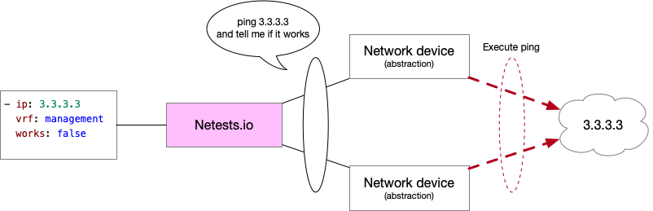

# Documentation

```shell
*-*-*-*-*-*-*-*-*-*-*-*-*-*-*-*-*-*-*-*-*-*-*-*-*-*-*-*-*-*-*-*-*-*-*-*-*-*-*-*-*-*-*-*-*-*-
 WELCOME TO NETESTS.IO DOCUMENTATION 
*-*-*-*-*-*-*-*-*-*-*-*-*-*-*-*-*-*-*-*-*-*-*-*-*-*-*-*-*-*-*-*-*-*-*-*-*-*-*-*-*-*-*-*-*-*-
```

## Introduction

In our current world, the stability of networks has become something of paramount importance.

There are many solutions to define / check that your network is working :

* Monitoring - Get metrcis with SNMP, "show" command, Telemetry, etc.
* Logging - Manage and use log messages send by devices.
* Alarming - Based on metrics and logging raise an alarms if something appears on your network.

And, for a few years **Testing**.

The goal of testing your network is to be sure that :

* All BGP sessions are UP and the session.
* Wires are correctly connected by checking LLDP neighbors.
* Destination are reachable by executing some Pings.
* etc.

One of the biggest problem is **How can I test my network automatically ?**


All of these tests should be run after each change to be sure that they have not created a problem on your netwok

Yet, the problem is that **we have to write some code to automate tests ...** But "*I'm a Network Engineer not a developer*".

That's why **Netests.io** was created ! The idea of **Netests.io** is to offer a way of testing your network without writing some codes !


## Netests features

Netests.io is based on a source of truth. This source is used to define which you exepect on your network.

When Netests.io is run, it will connect to the device, get informations by protocols and compare to your source of truth.

If the two results are the same, Netests will return a success, otherwise a failure.


Netests.io can connect to the device with `Netconf`, `ssh`, over a `rest api` and with `NAPALM` if the vendor is supported by NAPALM.

Not all connexion type are available for all devices. Some vendors don't support Netconf or REST API.

Please before to start have a look on ``vendors_and_protocols``.


### Modes

Netests.io can be used in two different ways.

##### Standard Mode

Run Netests.io with a shell command

```shell
netests -x -i hosts -a netests
```

Standard mode can be a step of a CI/CD pipeline or run as a scheduled script to be sure that the network works as you expect.


##### CLI Mode

Run Netests.io in a interactive mode

```shell
netests -x -i hosts --terminal
```

CLI mode can be used to troubleshoot the network or get informations from many devices

```shell
> get ospf
-*-*-*-*-*-*-*-*-*-*-*-*-*-*-*-*-*-*-*-*-*-*-*-*-*-*-*-*-*-*-*-*-*-*-*-*-*-*-*-*-*-*-*-*-*-*-*-*-*-*-*-*-*-
>>>>> leaf01 -- (ospf)
{   'hostname': 'leaf01',
    'vrfs': [   {   'areas': [],
                    'router_id': '51.51.51.51',
                    'vrf_name': 'default'},
                {   'areas': [   {   'area_number': '0.0.0.0',
                                     'neighbors': [   {   'local_interface': 'swp1',
                                                          'peer_hostname': 'NOT_SET',
                                                          'peer_ip': '10.1.2.2',
                                                          'peer_rid': '53.53.53.53',
                                                          'session_state': 'FULL'},
                                                      {   'local_interface': 'swp2',
                                                          'peer_hostname': 'NOT_SET',
                                                          'peer_ip': '10.1.20.2',
                                                          'peer_rid': '62.62.62.62',
                                                          'session_state': 'FULL'}]}],
                    'router_id': '151.151.151.151',
                    'vrf_name': 'NETESTS_VRF'}]}
-*-*-*-*-*-*-*-*-*-*-*-*-*-*-*-*-*-*-*-*-*-*-*-*-*-*-*-*-*-*-*-*-*-*-*-*-*-*-*-*-*-*-*-*-*-*-*-*-*-*-*-*-*-
>>>>> spine02 -- (ospf)
{   'hostname': 'spine02',
    'vrfs': [   {   'areas': [   {   'area_number': '0.0.0.0',
                                     'neighbors': [   {   'local_interface': 'NOT_SET',
                                                          'peer_hostname': 'NOT_SET',
                                                          'peer_ip': '10.1.20.1',
                                                          'peer_rid': '151.151.151.151',
                                                          'session_state': 'FULL'}]}],
                    'router_id': '62.62.62.62',
                    'vrf_name': 'default'}]}
>
```

>`spine02` is an Extreme Networks VSP
>
>`leaf01` is a Cumulus Networks


### Abstraction

Netests.io offers a vendor abstraction. Currently Netests.io supports **<u>7 differents OS.</u>**

* Arista Networks
* Cumulus Linux
* Extreme Networks VSP (VOSS)
* Cisco IOS-XE
* Cisco IOS-XR
* Juniper
* Cisco NX-OS

To run a test or get data from one of these hosts, the process is exactly the same !


### Protocols

For this version Netests.io is able to get information regarding <u>**6 "protocols"**</u>.

* BGP
* CDP
* Facts
* LLDP
* OSPF
* VRF

All protocols have been simplified based on the OpenConfig data models. The idea of Netests.io is not to show some output but compare and check that your network is in an expected state. To see protocols definition, go on the following link.

https://www.netests.io/protocols/

Netests.io will establish a connection to the device, get datas, and format them, into the data models.
https://www.netests.io/data_models/


### Tests

To test a network Netests.io will compare datas retrived from devices running configuration and compare to the source of truth.

There are also two others tests.

* BGP_UP

  Will verify that all BGP sessions are UP.

* PING

  Will execute a ping from a device. It's possible to define that the ping must work or not.




### Connexion

There are differents possibilities to connect to the device, by using

* CLI over SSH
* Netconf over SSH
* REST API


### Compatibilies

For each device and each protocols with each connexion types some parameters are retrieved. Unfortunately it is not possible to get all datas with all devices and all protocols with all connexion types. 

To know which parameters is getted by a connexion types and a specific OS, go on the following link.

https://www.netests.io/protocols_arguments/

To see compatibilies between OS and protocols, go on the following link.

https://www.netests.io/vendors_and_protocols/


### Architecture


> Note: this schema doesn't show dependency between libraries
>
> Example: `PyEZ` with `ncclient`


## Way of working

The network engineer job is evolving and the ways of working too.

### Current / Past

In a network (without automation) to execute a modification the next steps have to be done :

1. Execute a modification

   ```
   conf t
   router bgp 65321
     neighbors 1.1.1.1 remote as 1
     neighbors 1.1.1.1 description MY_NEW_PEER
   ```

2. Check that the configuration is applied and that the session is UP

   ```
   show ip bgp summary
   ```

3. Try to reach a network on other side to check 2 way

   ```shell
   ping 10.1.1.1
   ```


### With Netests

With network the steps are a bit differents. The verification will not be done directly one the devices.

1.  Execute a modification - Directly on the device (bad :confused:) or in a file and deploy with Ansible, Nornir etc. (good :smiley:).

   * Manually

   ```shell
   conf t
   router bgp 65321
     neighbors 1.1.1.1 remote as 1
     neighbors 1.1.1.1 description MY_NEW_PEER
   ```

   * With a configuration management tool

   ```yaml
   ---
   routing:
     bgp:
       local_as: 65321
       neighbors: 
         -  peer_ip: 1.1.1.1
            remote_as: 1
            description: MY_NEW_PEER
   ```

2. Update Netests tests (source of truth).

   * Add check to verify that the BGP new session is UP in ``truth_vars/hosts/{{ hostname }}/bgp.yml``

   ```yaml
   default:
     as_number: 65321
     router_id: 172.16.0.1
     neighbors:
     - peer_ip: 1.1.1.1
       remote_as: 65535
       state_brief: UP
   ```

   * Add ping to test reachability in ``truth_vars/hosts/{{ hostname }}/ping.yml``

   ```yaml
   - ip: 17.1.1.1
     vrf: default
     works: true
   ```

3. Run ``Netests.io``

   ```shell
   netests -x -i hosts -a netests.yml
   
   {   'bgp': {
   				Host: leaf02: True
   		},
       'bgp_up': {
   				Host: leaf02: True
   		},
       'cdp': None,
       'facts': {
   				Host: leaf02: True
   		},
       'lldp': None,
       'ospf': None,
       'vrf': {
   				Host: leaf02: True
   		},
   }
   ```

   > Protocols with a "None" is the protocols that has not been tested
   >
   > Don't be affraid about them :smiley:

   ```shell
   ⚡ echo $?
   0
   ```

   

### Integrate in a CI/CD pipeline

Based on the software developement good practice some companies try to develop (or already have) a CI/CD pipeline.

On of the important step is to **test** the modification. Netests.io can be used to do the step.


In your CI/CD pipeline just add a step where you are running **netests**.

```shell
⚡ netests -x -i hosts -a netests.yml
```

The task will failed if a test will failed.


## Git Repositories

#### Gitlab (Official)

https://gitlab.com/DylanHamel/netests

#### Github (Mirror)

https://github.com/Netests/netests

