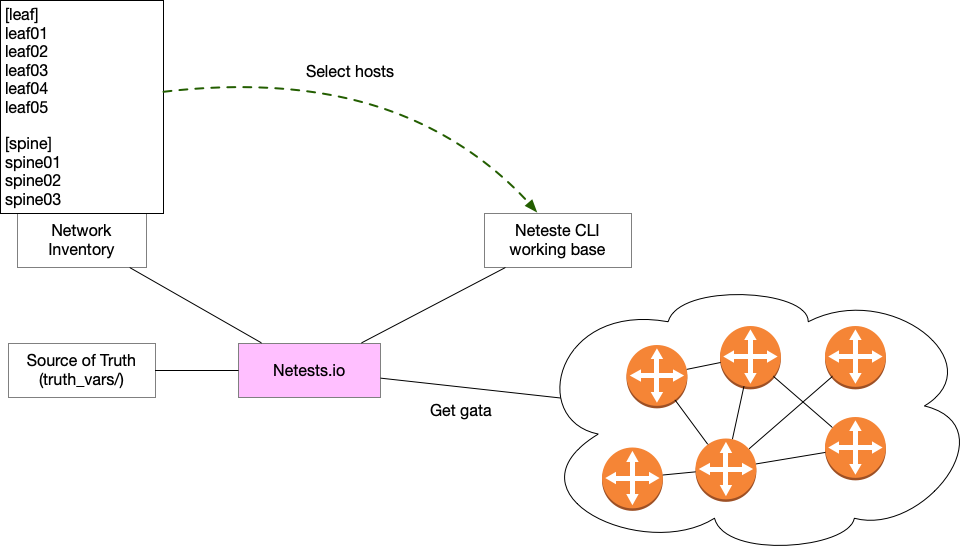
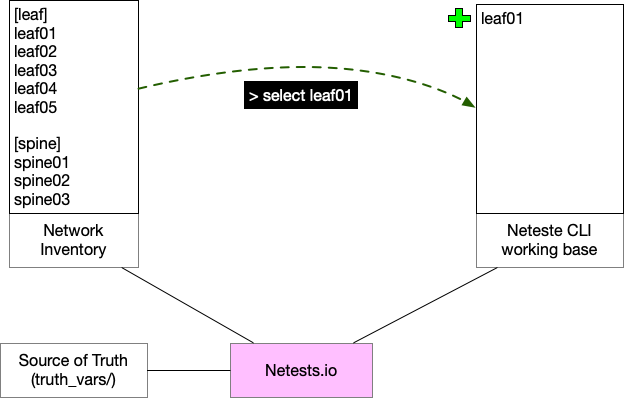
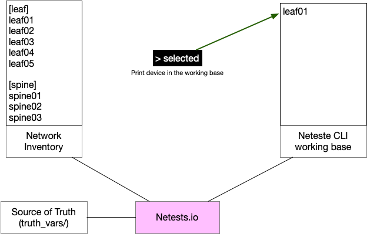
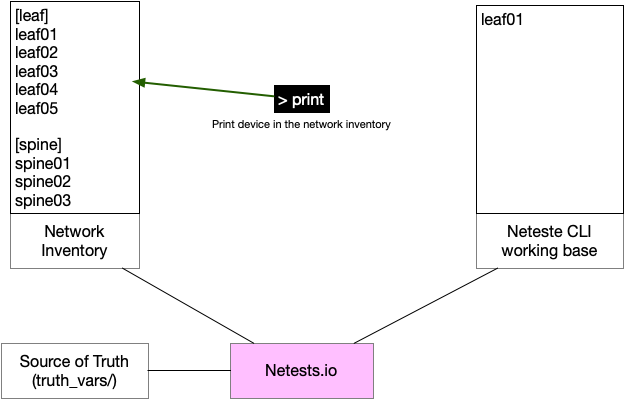
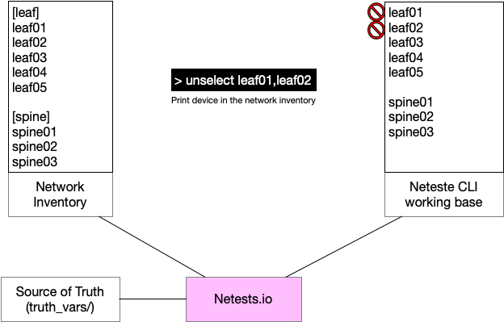

Netests.io offers a CLI to interact with devices without running all the scripts for all devices.

The goal of this CLI is to troubleshoot your network with a way of working similar to the "actual" way.

1. Open a shell
2. Execute command


This CLI is based on your inventory as the standard mode.

It is possible to get informations only from one, or more devices. To realize it, there is a **working base**. If you would like get OSPF informations, Netests CLI will get them on all hosts that are in this working based.

> That means that some hosts can be in your inventory but not in your working based !

An example of the usefulness is that if there is a problem on two hosts, it is possibe to `select` these two hosts and `get` or `compare` datas only for these two in an interactive mode.


## Architecture



## Run

To start Netests CLI use `-t` or `--terminal`.

Netests CLI is also based on a network inventory. 

Network inventory need to be specified

```shell
netests -x -i hosts --terminal
# netests -x -i hosts -t
```

> -x => It's an Ansible inventory
>
> -i => Path to Ansible inventory
>
> For more information, go on the following link.
>
> https://www.netests.io/inventory/

```shell
-*-*-*-*-*-*-*-*-*-*-*-*-*-*-*-*-*-*-*-*-*-*-*-*-*-*-*-*-*-*-*-*-*-*-*-*-*-*-*-*-*-*-*-*-*-*-*-*-*-*-*-*-*-*-
Welcome to Netests CLI
-*-*-*-*-*-*-*-*-*-*-*-*-*-*-*-*-*-*-*-*-*-*-*-*-*-*-*-*-*-*-*-*-*-*-*-*-*-*-*-*-*-*-*-*-*-*-*-*-*-*-*-*-*-*-
>
```


## Commands

As introduce, Netests CLI use a **working base** different than the network inventory.

The first step consists to add / select hosts in the **working base**

### Select 

To add hosts in the working base, use `select` command



#### Select one

To add only one host to the working based, use the following syntax.

```shell
> select {{ hostname }}
```

Example

```shell
> select leaf01
@Followings devices are selected :
@['leaf01']
```

#### Select Many

To add multiple hosts to the working based with one command, use the following syntax.

```shell
> select {{ hostname1 }},{{ hostname2 }}
```

List hostnames separate by `,`.

Example

```shell
> select leaf01,spine02
@Followings devices are selected :
@['leaf01', 'spine02']
```

#### Select all

To add all hosts defined in the network inventory in the working base, use the following syntax.

```shell
> select *
```

Example

```shell
> select *
@Followings devices are selected :
@['leaf01', 'leaf03', 'spine02']
```

### Selected

This command prints all hosts that are actually selected in the working based.

```shell
> selected
@Followings devices are selected :
@['leaf01', 'spine02']
```




### Print

This command prints hosts informations based on the **network inventory**. 

> `selected` to print host in the working base.
>
> `print` to print host in the inventory.



#### Print one

To print information regarding a specific host defined in the network inventory, use the following syntax.

```shell
> print {{ hostname }}
```

Example

```shell
> print leaf01
{   'leaf01': {   'connexion': 'ssh',
                  'hostname': '172.16.194.51',
                  'platform': 'linux',
                  'port': 22}}
```

#### Print Many

To print information regarding multiple hosts defined in the network inventory, use the following syntax.

```shell
> print {{ hostname1 }},{{ hostname2 }}
```

List hostnames separate by `,`.

Example

```shell
> print leaf01,spine02
{   'leaf01': {   'connexion': 'ssh',
                  'hostname': '172.16.194.51',
                  'platform': 'linux',
                  'port': 22},
    'spine02': {   'connexion': 'ssh',
                   'hostname': '172.16.194.62',
                   'platform': 'extreme_vsp',
                   'port': 22}}
```

#### Print

To print information regarding all hosts defined in the network inventory, use the following syntax.

```shell
> print *
```

Example

```shell
> print *
{   'leaf01': {   'connexion': 'ssh',
                  'hostname': '172.16.194.51',
                  'platform': 'linux',
                  'port': 22},
    'leaf03': {   'connexion': 'api',
                  'hostname': '172.16.194.53',
                  'platform': 'eos',
                  'port': 443},
    'spine02': {   'connexion': 'ssh',
                   'hostname': '172.16.194.62',
                   'platform': 'extreme_vsp',
                   'port': 22}}
```


### Unselect

To remove host from the working base, use `unselect` command.



#### Unselect one

To remove only one host from the working based, use the following syntax.

```shell
> unselect {{ hostname }}
```

Example

```shell
> selected
@Followings devices are selected :
@['leaf01', 'spine02', 'leaf03']
>
> unselect leaf01
@Followings devices are selected :
@['spine02', 'leaf03']
```

#### Unselect Many

To remove multiple hosts from the working based with one command, use the following syntax.

```shell
> unselect {{ hostname1 }},{{ hostname2 }}
```

List hostnames separate by `,`.

Example

```shell
> selected
@Followings devices are selected :
@['spine02', 'leaf03', 'leaf01']
>
> unselect leaf03,leaf01
@Followings devices are selected :
@['spine02']
```

#### Unselect all

To remove all hosts defined in the network inventory from the working base, use the following syntax.

```shell
> unselect *
```

Example

```powershell
> selected
@Followings devices are selected :
@['spine02', 'leaf01', 'leaf03']
>
> unselect *
@Followings devices are selected :
@[]
```

### Get

Once equipment has been selected, it is possible to `get` information regarding a specific protocols.

To realize this task use `get` with the following syntax.

```shell
get {{ protocol }}
```

> Note that only protocols defined in the following page is supported by Netests CLI.
>
> https://www.netests.io/vendors_and_protocols/
>
> Be sure that the connexion mode and vendor are compatible with the protocol :smiley:

Example

```shell
> get ospf
-*-*-*-*-*-*-*-*-*-*-*-*-*-*-*-*-*-*-*-*-*-*-*-*-*-*-*-*-*-*-*-*-*-*-*-*-*-*-*-*-*-*-*-*-*-*-*-*-*-*-*-*-*-
>>>>> leaf01 -- (ospf)
{   'hostname': 'leaf01',
    'vrfs': [   {   'areas': [],
                    'router_id': '51.51.51.51',
                    'vrf_name': 'default'},
                {   'areas': [   {   'area_number': '0.0.0.0',
                                     'neighbors': [   {   'local_interface': 'swp1',
                                                          'peer_hostname': 'NOT_SET',
                                                          'peer_ip': '10.1.2.2',
                                                          'peer_rid': '53.53.53.53',
                                                          'session_state': 'FULL'},
                                                      {   'local_interface': 'swp2',
                                                          'peer_hostname': 'NOT_SET',
                                                          'peer_ip': '10.1.20.2',
                                                          'peer_rid': '62.62.62.62',
                                                          'session_state': 'FULL'}]}],
                    'router_id': '151.151.151.151',
                    'vrf_name': 'NETESTS_VRF'}]}
>
```


### Options

In a `get` some information retrieved can be unsless. To select which parameter will be selected, use the `options` command.

Example

Get `Facats` informations.

```shell
> get facts
-*-*-*-*-*-*-*-*-*-*-*-*-*-*-*-*-*-*-*-*-*-*-*-*-*-*-*-*-*-*-*-*-*-*-*-*-*-*-*-*-*-*-*-*-*-*-*-*-*-*-*-*-*-
>>>>> leaf01 -- (Facts)
{   'base_mac': '50:00:00:02:00:00',
    'build': 'Cumulus Linux 4.0.0',
    'domain': 'NOT_SET',
    'hostname': 'leaf01',
    'interfaces_lst': [   'swp5',
                          'swp2',
                          'swp3',
                          'swp1',
                          'swp6',
                          'swp7',
                          'swp4',
                          'eth0'],
    'memory': 944388,
    'model': 'VX',
    'serial': '50:00:00:02:00:00',
    'vendor': 'Cumulus Networks',
    'version': '4.0.0'}
```

There are too many informations that are not interessting yet like (`serial`, `memory`, etc.).

To filters informations thath will be printed, use `options` command with the following syntax.

```shell
> options {{ protocol }} {{ arg01}},{{ arg02}}
```

List arguments separate by `,`.

```shell
> options facts hostname,model,version
@New (facts) options are :
{   'base_mac': False,
    'build': False,
    'domain': False,
    'hostname': True,
    'interfaces_lst': False,
    'memory': False,
    'model': True,
    'options': False,
    'serial': False,
    'vendor': False,
    'version': True}
>
> get facts
-*-*-*-*-*-*-*-*-*-*-*-*-*-*-*-*-*-*-*-*-*-*-*-*-*-*-*-*-*-*-*-*-*-*-*-*-*-*-*-*-*-*-*-*-*-*-*-*-*-*-*-*-*-
>>>>> leaf01 -- (Facts)
{'Facts': {'hostname': 'leaf01', 'model': 'VX', 'version': '4.0.0'}}
```

> This feature is not implemented for all protocols


### Show

To use `options` command, you have to know which arguments defined the protocols. `show` command is used to print all arguments about a protocol. 

To use this command, respect the following syntax.

```shell
> show {{ protocol }}
```

Example

```shell
> show vrf
{   'exp_targ': <class 'str'>,
    'imp_targ': <class 'str'>,
    'l3_vni': <class 'str'>,
    'options': <class 'dict'>,
    'rd': <class 'str'>,
    'rt_exp': <class 'str'>,
    'rt_imp': <class 'str'>,
    'vrf_id': <class 'str'>,
    'vrf_name': <class 'str'>,
    'vrf_type': <class 'str'>}
>
```


### More 

Once some options have been selected `more` command can be used to print options selected for a specific protocol.

To use this command, respect the following syntax.

```shell
> more {{ protocol }}
```

Example

```shell
> more facts
{   'base_mac': False,
    'build': False,
    'domain': False,
    'hostname': True,
    'interfaces_lst': False,
    'memory': False,
    'model': True,
    'options': False,
    'serial': False,
    'vendor': False,
    'version': True}
```

It shows that only `hostname`, `model` and `version` will be printed.

```shell
> more vrf
@All class arguments are defined as True
>
> options vrf vrf_name
@New (vrf) options are :
{   'exp_targ': False,
    'imp_targ': False,
    'l3_vni': False,
    'options': False,
    'rd': False,
    'rt_exp': False,
    'rt_imp': False,
    'vrf_id': False,
    'vrf_name': True,
    'vrf_type': False}
>
> more vrf
{   'exp_targ': False,
    'imp_targ': False,
    'l3_vni': False,
    'options': False,
    'rd': False,
    'rt_exp': False,
    'rt_imp': False,
    'vrf_id': False,
    'vrf_name': True,
    'vrf_type': False}
>
> get vrf
-*-*-*-*-*-*-*-*-*-*-*-*-*-*-*-*-*-*-*-*-*-*-*-*-*-*-*-*-*-*-*-*-*-*-*-*-*-*-*-*-*-*-*-*-*-*-*-*-*-*-*-*-*-
>>>>> leaf01 -- (vrf)
[
	{'vrf_name': 'default'},
	{'vrf_name': 'NETESTS_VRF'},
	{'vrf_name': 'mgmt'}
]
```


### Compare

To execute a live comparaison of the running configuration with the source of truth, use `compare` command with the follwing syntax.

> Compare function will be executed only on hosts selected in the working base.

```shell
compare {{ protocol }}
```

Example

```Shell
> compare ospf
-*-*-*-*-*-*-*-*-*-*-*-*-*-*-*-*-*-*-*-*-*-*-*-*-*-*-*-*-*-*-*-*-*-*-*-*-*-*-*-*-*-*-*-*-*-*-*-*-*-*-*-*-*-*-
@Compare function result :
{'ospf': {Host: leaf01: True}}
```


### Help

Netests.io can help you if you are lose in the CLI :smile:.

#### General

 To ask general help, use `help` command.

Example

```Shell
> help
+------------------------------------------------------------+
|                       Netests Help                         |
+------------------------------------------------------------+
| [help]      Display help                                   |
| [select]    Select devices on which on action will be exec |
| [unselect]  Remove a device from the selected              |
| [selected]  Show devices currently selected                |
| [get xx]   Get XX protocols informations                   |
| [options]   Set arguments that will retrieve for a Protocol|
| [more xx]  Show XX Protocol class arguments selected       |
| [show xx]  Show XX Protocol class arguments                |
| [print yy]  Show YY devices informations                   |
| [compare yy xx]  Compare device config with source of truth|
| [exit]  Quit Netests CLI                                   |
+------------------------------------------------------------+
```

#### Command

To ask help about a specific command use the following syntax.

```shell
help {{ command }}
```

Example

```shell
> help compare
+------------------------------------------------------------+
|                 Netests - Exit Commands                    |
+------------------------------------------------------------+
| It is possible, from the CLI, to compare your network      |
| devices configuration with the configuration defined in    |
| the source of truth.                                       |
|                                                            |
| Format :                                                   |
|   > compare {{ protocol }}                                 |
|                                                            |
| Examples :                                                 |
|   > compare vrf                                            |
|                                                            |
+------------------------------------------------------------+
```


## Youtube

On the following link you can find an basic example of Netests CLI.

https://www.youtube.com/watch?v=_WStUkQLWEU&t=7s