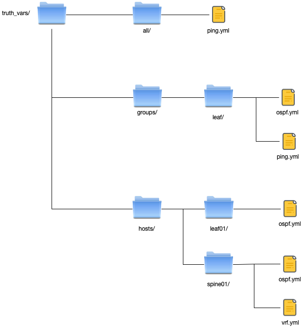
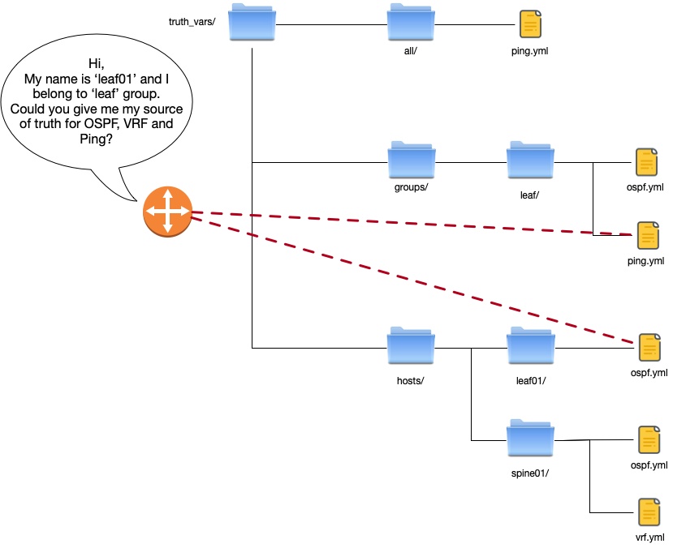
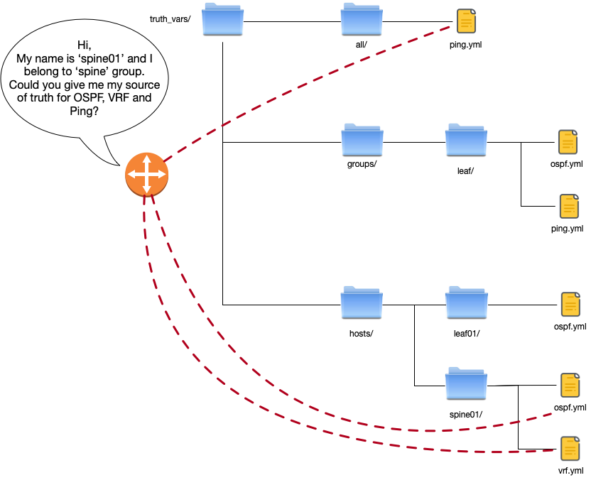

Below a brief explication how you can create your source of truth.

## Create folders

To avoir to create manually all folders. An arguments it available.

```shell
netests --init-folders
```

```shell
truth_vars
├── all
├── groups
└── hosts
```


## How it works ?

There are 3 locations where Netests.io will try to get your source of truth.

1. The one with the highest priority `truth_vars/hosts/`.

   Netests.io will try to get data defined in `truth_vars/hosts/{{ inventory_hostname }}/{{ protocol}}.yml`

2. If no data was found, the second step is to search data in `truth_vars/groups/`

   Netests.io will try to get data from `truth_vars/groups/{{ groups[0] }}/{{ protocols }}.yml `

   > Due to the use of the group at index zero of the list of groups to which this hosts belong. This function is not currently recommended. But it can be use without any problem if you hosts belong to only one group :smiley:

3. Finally, if there is still no data found, the last step is to search data in `truth_vars/all/`.

   Netests.io will try to get data from `truth_vars/all/{{ protocols }}.yml `


**If there is no source of truth the protocol will not be tested !!!**


### Example

Suppose the following architecture.



Two devices will try to get data for 3 protocols.

| Device Type        | Hostname | Groups    |
| ------------------ | -------- | --------- |
| Cumulus Linux      | leaf01   | ['leaf']  |
| Juniper Network MX | spine02  | ['spine'] |



1. Device will get informations that are defined in `truth_vars/hosts/leaf01/`

   => Only OSPF informations are defined as source of truth for `leaf01`.

2. Device will get informations that are defined in `truth_vars/groups/leaf/`

   => OSPF informations are already defined, OSPF informations will not be replaced. But PING informations that are not defined will  be saved as source of truth for `leaf01`.

3. Finally, device will get informations that are defined in `truth_vars/all/`

   => No more informations are found.

   That means that VRF will not be tested for `leaf01` !




1. Device will get informations that are defined in `truth_vars/hosts/spine01/`

   => OSPF and VRF informations are defined as source of truth for `spine01`.

2. Device will get informations that are defined in `truth_vars/groups/spine/`

   => The folder doesn't exist, no informations will be added.

3. Finally, device will get informations that are defined in `truth_vars/all/`

   => There are some PING informations. PING will be added in source of truth source of truth for `leaf01`.


| Device Name | OSPF                                | PING                         | VRF                                |
| ----------- | ----------------------------------- | ---------------------------- | ---------------------------------- |
| leaf01      | `truth_vars/hosts/leaf01/ospf.yml`  | `truth_vars/groups/ping.yml` | Not found                          |
| Spine01     | `truth_vars/hosts/spine01/ospf.yml` | `truth_vars/all/vrf.yml`     | `truth_vars/hosts/spine01/vrf.yml` |


## Create your source 

Netests.io offers an option to create all truth_vars.

If the networks is working well and to avoid to create manually each files `--init-data` is available.

This feature will connect to all devices in the inventory get all informations regarding protocols enabled in the `netests.yml` and create all files.

```shell
netests -x -i inventory/ansible/hosts -a netests.yml --init-data
```

* `hosts` (inventory file)

```shell
[leaf]
leaf01
```

* `host_vars/leaf01.yml` (that define `leaf01`)

```shell
hostname: 172.16.194.51
platform: linux
username: cumulus
password: CumulusLinux!
connexion: ssh
port: 22
```

* `netests.yml` Netests.io configuration file

```yaml
config:
  protocols:
    facts:
      test: true
    lldp:
      test: true
    ospf:
      test: true
```


#### Result:

```yaml
truth_vars
├── all
├── groups
└── hosts
    ├── leaf01
        ├── facts.yml
        ├── lldp.yml
        └── ospf.yml
```

Contents :

* `facts.yml`

```yaml
base_mac: '50:00:00:02:00:00'
build: Cumulus Linux 4.0.0
domain: NOT_SET
hostname: leaf01
interfaces_lst:
- swp5
- swp2
- swp3
- swp1
- swp6
- swp7
- swp4
- eth0
memory: 944388
model: VX
serial: '50:00:00:02:00:00'
vendor: Cumulus Networks
version: 4.0.0

```

* `lldp.yml`

```yaml
- local_name: leaf01
  local_port: swp1
  neighbor_mgmt_ip: 53.53.53.53
  neighbor_name: leaf03.dh.local
  neighbor_os: NOT_SET
  neighbor_port: Ethernet1
  neighbor_type:
  - Bridge
  - Router
- local_name: leaf01
  local_port: swp2
  neighbor_mgmt_ip: 172.16.194.62
  neighbor_name: spine02
  neighbor_os: VSP-8284XSQ (8.1.0.0)
  neighbor_port: 1/1
  neighbor_type:
  - Bridge
  - Router

```

* `ospf.yml`

```yaml
hostname: leaf01
vrfs:
- areas: []
  router_id: 51.51.51.51
  vrf_name: default
- areas:
  - area_number: 0.0.0.0
    neighbors:
    - local_interface: swp1
      peer_hostname: NOT_SET
      peer_ip: 10.1.2.2
      peer_rid: 53.53.53.53
      session_state: FULL
    - local_interface: swp2
      peer_hostname: NOT_SET
      peer_ip: 10.1.20.2
      peer_rid: 62.62.62.62
      session_state: FULL
  router_id: 151.151.151.151
  vrf_name: NETESTS_VRF

```


